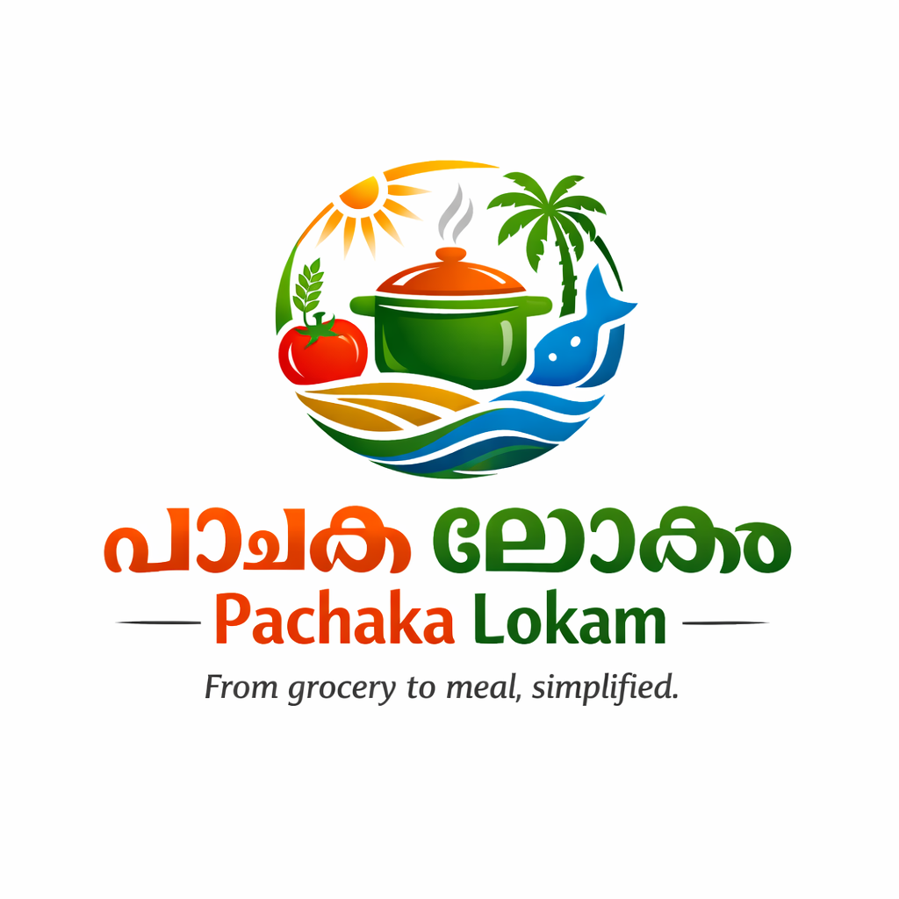

# Pachaka Lokam

**From grocery to meal, simplified.**

<p align="center">
  
</p>

<p align="center">
  <a href="https://pachakalokam.prashobhpaul.com">
    
  </a>
  <a href="https://pachakalokam.prashobhpaul.com">
    
  </a>
  <a href="https://github.com/PrashobhPaul/Pachaka-Lokam/releases/latest/download/pachaka-lokam.apk">
    
  </a>
  <a href="https://github.com/PrashobhPaul/Pachaka-Lokam/releases/latest">
    
  </a>
</p>

<p align="center">
  <a href="https://github.com/PrashobhPaul/Pachaka-Lokam/blob/main/LICENSE">
    
  </a>
  
  
  
  
</p>

A 100% offline kitchen and meal planning companion for South Indian households — covering **Kerala, Tamil Nadu, Andhra Pradesh, Telangana, and Karnataka**. Suggests today's meals from what's actually in your kitchen, knows your festival menus, and tracks daily household services. No accounts, no cloud, no tracking.

---

## 📥 Install

### Android (recommended)

| Method | How |
|---|---|
| **APK sideload** *(easiest)* | [Download the latest APK](https://github.com/PrashobhPaul/Pachaka-Lokam/releases/latest/download/pachaka-lokam.apk) → tap to install. See [install guide](#-android-install-guide) below if your phone shows a warning. |
| **PWA from browser** | Open [pachakalokam.prashobhpaul.com](https://pachakalokam.prashobhpaul.com) in Chrome → tap **⬇ Install** in the app header. |

### iOS / iPadOS
Open [pachakalokam.prashobhpaul.com](https://pachakalokam.prashobhpaul.com) in Safari → tap **Share** → **Add to Home Screen**.

### Desktop
Chrome / Edge: open the URL → click the install icon in the address bar.

> The app works **fully offline** once installed. Your data lives only on your device — no accounts, no cloud, no tracking.

---

## 📲 Android install guide

Sideloading an APK is safe — Android just asks you to confirm because the app isn't from the Play Store.

1. **Download the APK** from the link above. Your browser may warn that the file type can be harmful — tap **OK** / **Download anyway**. The APK is signed with a stable key; you can verify the signature in [Releases](https://github.com/PrashobhPaul/Pachaka-Lokam/releases).
2. **Open the downloaded APK** from your notifications or the Files app.
3. **First time only:** Android asks "Allow this source to install apps?" → tap **Settings** → toggle **Allow from this source** ON → press back.
4. Tap **Install**. Play Protect may show a "Not a known app" notice — tap **Install anyway**. Play Protect verifies the app, doesn't block legitimate apps.
5. Tap **Open** when install completes. You're set.

**Why isn't it on the Play Store?** Because we don't want to add accounts, telemetry, or tracking — and a Play listing comes with paperwork that doesn't fit a free, no-data-collection app. The source code is in this repo. The APK is reproducible.

**How do I update?** Watch this repo (top-right ⭐ → Watch → Releases only) — GitHub will email you when a new APK is published. Sideloaded APKs don't auto-update; download the new one and reinstall (your data stays on the device).

---

## ✨ Features

### Smart meal suggestions from your kitchen
The meal engine matches your pantry against regional recipes in real time. If you have rice, toor dal, and drumstick, it knows you can make sambar. Each curry only checks for 1–2 defining ingredients — staple spices (chilli, curry leaves, mustard, turmeric, cumin, ginger, garlic, oil) are assumed always available. Suggestions are 80% biased toward simple everyday cooking and 20% special.

### Five South Indian regions
- **Kerala** — Sambar, Avial, Thoran, Kaalan, Olan, Erissery, Puttu + Kadala, Appam + Stew
- **Tamil Nadu** — Sambar, Rasam, Kootu, Poriyal, Pongal, Rava Dosa, Chettinad
- **Andhra Pradesh** — Pappu, Vepudu, Gutti Vankaya, Pesarattu, Pulihora, Fish Pulusu
- **Telangana** — Pappu, Pulusu, Vepudu, Pesarattu + Upma, Natu Kodi Pulusu
- **Karnataka** — Huli, Saaru, Bisi Bele Bath, Vangi Bath, Akki Roti, Ragi Mudde

Lunch and dinner are strictly rice-based — chapati appears only as a rare substitute.

### ⭐ My Favourites *(new in v2.1)*
Save your family recipes, your sub-region's variants, or anything else not in the seed catalogue — Mangalore Buns, Malabar Biryani, Mysore Bonda, Amma's Sambar. Custom meals plug straight into the suggestion engine: when their main ingredients are in your kitchen, they show up alongside the regional menu.

Adding a meal lets you also add new ingredients to your kitchen (e.g. "mandi spice mix") so the engine can match them. Custom ingredients survive Reset Month.

### ↗ Share & Import recipes *(new in v2.1)*
Share a single recipe or your whole weekly plan with one tap. The app encodes the recipe into a URL — paste it into WhatsApp, Telegram, or any messaging app. The recipient opens the link, previews the recipe, and adds it to their favourites with one tap. The URL is just a carrier — **no data goes through any server**.

If a friend sends you a link and the app doesn't auto-open, paste it from **Reminders → Settings → Paste shared link**.

### 💾 Backup & Restore *(new in v2.1)*
**Reminders → Settings → Backup** creates a single file with everything — favourites, kitchen, plans, trackers, settings. Send it to yourself on WhatsApp, Drive, or email. Optional passphrase encryption (AES-GCM 256). Restore on a new phone with **Merge** (safe, additive) or **Replace** modes.

The app nudges you with a quiet toast if your last backup is over 30 days old. No nag screens.

### 🎉 Festival Intelligence
Festivals across all five states with three plan-resolution types:
- **Progressive** — Multi-day plans where each day is distinct (Pongal, Sankranti)
- **Pattern** — Template cycling from simple to grand (Onam, Navaratri, Bathukamma)
- **Static** — Fixed meals for single-day festivals (Vishu, Ugadi, Ganesh Chaturthi, Diwali, Christmas)

When a festival is active, a banner appears with the greeting and today's prescribed meals. Choose to override regular suggestions, show festival meals as suggestions only, or turn off festival mode.

### 🍳 Kitchen & Grocery
71+ seeded grocery items across 8 categories. Update quantities as you use them; mark items as "Out" to move them to the shopping list. Monthly reset to start fresh. "Bought" returns items to the kitchen. Floating bulk-action bar — tick multiple items, restock or grocery-list them in one save.

### 📅 Maid, Milk, Newspaper Tracker
Monthly calendar with tap-to-cycle tracking (blank → present → absent → blank) for three services. Six stat cards show monthly counts at a glance. Onboarding lets you turn off services you don't use.

### 🔥 Gas Cylinder Tracker
Records when a new cylinder was started and shows running days used — helps predict refill timing.

### 🍲 Weekly Meal Plan Generator
Generates 7-day plans respecting pantry, beverage preference, and the 80/20 simple-to-special ratio. Shows missing ingredients with an "Approve → Grocery" workflow. Save and reapply weekly templates. Share the whole plan with one tap.

### 🔔 Smart Reminders
Daily/weekly/custom reminders with browser notifications. Meal-time alerts. Water reminders with daily glass tracking. Festival notifications.

### 👋 First-run onboarding *(new in v2.1)*
A 5-step setup, all skippable: region → diet & beverage → festival mode + fasting days (Tue/Fri/Sat veg) → which household services you track → quick-stock 12 staples. Re-runnable anytime from Settings.

---

## 🏗 Architecture

This is a **pure static PWA** — no backend, no framework, no build step.

| Aspect | Detail |
|---|---|
| **Runtime** | Vanilla JavaScript (ES2020+) |
| **State** | localStorage (`pl_state_v7`) |
| **Offline** | Service worker with cache-first strategy (`pl-v10`) |
| **Android** | Ready for Capacitor or TWA conversion |
| **Size** | ~110 KB total (excluding icon) |

### File structure

```
pachaka-lokam/
├── index.html              # Single-page app shell with 6 tabs
├── data.js                 # Grocery seed, regional curries, meal rules, festivals
├── app.js                  # Store, meal engine, festival service, UI rendering
├── favourites.js           # Custom meals + custom ingredients (v2.1)
├── share.js                # Share/import codec + modals (v2.1)
├── backup.js               # File-based backup/restore + AES-GCM (v2.1)
├── onboarding.js           # 5-step first-run wizard (v2.1)
├── app.css                 # All styles (responsive, mobile-first)
├── sw.js                   # Service worker (cache pl-v10)
├── manifest.webmanifest    # PWA manifest (standalone, portrait)
├── assets/
│   └── logo.png            # App icon (512x512, maskable)
├── CLAUDE.md               # AI assistant context file
└── README.md               # This file
```

### Key technical decisions

**Ingredient matching uses exact token matching**, not substring. `pantry.has("rice")` won't falsely match "rice bran oil". The `has()` function lowercases and does `Set.has()` against the pantry, with a `STAPLE_INGREDIENTS` allowlist for things like chilli, curry leaves, oil.

**Side dishes are resolved dynamically.** Kerala's `withThoran:true` picks from `THORAN_VEG` based on what's in your kitchen. Similar pools for Poriyal (TN), Vepudu (AP/TG), Palya (KA), and various Sambar/Avial/Kootu vegetable lists.

**Curries use `minFrom`/`minCount` for flexible matching.** Sambar needs toor dal + at least 2 vegetables from `SAMBAR_VEG`. Avial needs coconut + curd + at least 3 from `AVIAL_VEG`. Produces dynamic descriptions like "Sambar (drumstick, carrot)".

**Festival resolution is date-driven.** `FestivalService.getActive(region)` checks if today falls within any festival's date range, computes the day index, and resolves the meal plan accordingly.

**Favourites integrate into the same engine.** `getMealRules()` merges the user's favourites into the active region's rule pool — they compete on the same simple/special/priority scoring as built-in rules. No special path, no forced inclusion (unless the user pins one by setting priority 1).

**Share payloads are URL-encoded JSON.** Compact-key format, base64url-encoded with version prefix `v1.`. A single recipe ~300–500 chars; a 7-day plan ~1.2–1.5 KB. UTF-8 safe (Malayalam/Tamil/Telugu/Kannada characters round-trip cleanly).

**Backup files are plain JSON** (or `.plenc` if encrypted with PBKDF2-derived AES-GCM-256). The Web Share API delivers them via the system sheet, falling back to a download anchor.

---

## 🗂 UI tabs

| Tab | Purpose |
|---|---|
| **Today** | Today's meal suggestions, festival banner, gas cylinder widget, ⭐ Favourites, + Custom meal |
| **Kitchen** | Pantry inventory grouped by category, bulk-update bar |
| **Grocery** | Shopping list, ↗ Share to WhatsApp |
| **Meal Plan** | 7-day plan generator, template save/load, ↗ Share plan |
| **Reminders** | Smart reminders, monthly tracker calendar, ⚙️ Settings (Backup, Paste link, Re-run setup) |
| **Festivals** | All festivals for your region with Live/Upcoming/Past status |

---

## 🛠 Running locally

No build step needed. Just serve the files:

```bash
# Python
python3 -m http.server 8080

# Node
npx serve .
```

Then open `http://localhost:8080` on your phone or desktop.

---

## 📱 Android conversion

The app is structured for easy Android conversion via two approaches:

### Option A: Capacitor
```bash
npm init -y
npm install @capacitor/core @capacitor/cli
npx cap init "Pachaka Lokam" com.pachakalokam.app --web-dir .
npx cap add android
npx cap sync
npx cap open android
```

### Option B: TWA (Trusted Web Activity)
Deploy to any static host (GitHub Pages, Netlify, Vercel), then wrap with TWA via Bubblewrap. Requires HTTPS. See [`DEPLOYMENT.md`](DEPLOYMENT.md).

---

## 📦 Data model (localStorage)

```javascript
{
  items: [...],                 // Kitchen inventory
  plans: { ... },               // Weekly meal plans by date key
  reminders: [...],
  tracker: { maid, milk, newspaper },
  settings: {
    region: "Kerala",
    beverage: "tea",
    dietPref: "nonveg",         // veg | egg | nonveg (v2.1)
    festivalMode: "override",
    services: { maid, milk, newspaper, gas },  // (v2.1)
    shareName: ""               // (v2.1)
  },
  vegRestrictions: { days: [], months: [] },
  gasCylinder: { startDate },
  template: null,               // Saved weekly template
  specialDays: [...],
  favourites: {                 // (v2.1)
    meals: [...],
    customIngredients: [...]
  },
  onboarded: false,             // (v2.1)
  lastBackupAt: null            // (v2.1)
}
```

---

## 🥘 Regional curry catalogue

| Region | Curries | Highlights |
|---|---|---|
| **Kerala** | 18 | Sambar, Avial, Thoran (3), Kaalan, Olan, Erissery, Pulissery, Moru Curry, Kootu Curry |
| **Tamil Nadu** | 12 | Sambar, Rasam, Kootu, Poriyal, Vathal Kuzhambu, Mor Kuzhambu, Sundal, Chettinad |
| **Andhra Pradesh** | 10 | Pappu, Sambar, Rasam, Vepudu, Gutti Vankaya, Tomato Pappu, Fish Pulusu |
| **Telangana** | 9 | Pappu, Pulusu, Rasam, Vepudu, Gutti Vankaya, Natu Kodi Pulusu |
| **Karnataka** | 11 | Huli, Saaru, Palya, Gojju, Kootu, Majjige Huli, Ennegayi, Saagu |

Anything missing for your sub-region? Use **+ Custom meal** to add it — it'll be suggested whenever its ingredients are in your kitchen.

---

## 🔐 Privacy

- Your data lives **only on your device** in `localStorage`. Nothing leaves it.
- The app makes **no network calls** during normal use — no analytics, no tracking, no ads, no SDKs.
- The **only** network-touching feature is optional Share/Import: when you tap Share, the app encodes the recipe into a URL — no server is involved, the URL is just text the recipient opens.
- Backup files are local. Encryption is your choice.
- See [`privacy-policy.html`](privacy-policy.html) for the full policy.

---

## 🤝 Contributing

This is a personal/non-profit project. Contributions welcome for:
- Adding more regional curries with authentic pairings
- Karnataka coastal (Mangalore/Udupi), Kerala Malabar Muslim cuisine, Tamil Nadu Chettinad/Kongunadu sub-regions
- Festival date computation for years beyond 2028
- Better PWA install experience
- Screenshots in Malayalam, Tamil, Telugu, Kannada

---

## 📜 License

MIT

---

*Built with care for South Indian kitchens.*
